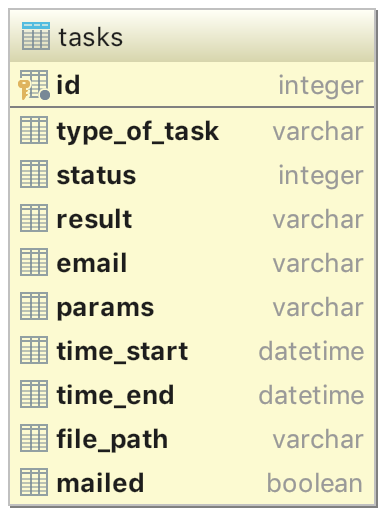

# HardWorker

### Это система выполнения тяжелых отложенных задач

## Установка

`pip install hardworker-1.0.tar.gz`

## Подключение к проекту

`from hardworker import app,hardworkerapp,task,BaseTask`

## Конфигурационный файл

В файле конфигурации - `hardworkerapp.config` есть следующие поля:

 * `'MAX_COUNT'` - общее количество одновременно запущенных задач, значение по умолчанию - `5`
 * `'MAX_TYPE_COUNT'` - количество одновременно запущенных задач с определенным типом, значение по умолчанию - `{}`
 * `'MAIL_SERVER'` - сервер для отправки e-mail, по умолчанию - `'smtp.yandex.ru:465'`
 * `'MAIL_LOGIN'` - логин для подключения к почтовому ящику
 * `'MAIL_PASSWORD'` - пароль для подключения к почтовому ящику
 * `'MAIL_FROM'` - имя отправителя в письме, значение по умолчанию - `HardWorker`
 * `'MAIL_SUBJECT'` - тема письма, значение по умолчанию - `Your task finished`

 Поля `'MAIL_LOGIN'` и `'MAIL_PASSWORD'` необходимо заполнить вручную, без заполнения их валидными данными, программа выдаст ошибку:`Exception: Not valid server/mail/password`. В случае отсутствия подключения к интернету программа запустится и с заполнеными данными и без, но если они будут заполнены и в процессе работы программы связь наладится - письма уйдут адресатам.
 
## Работа с задачами

Задачи можно задавать двумя способами:

### Декораторы

```
@task(name="task")
def task(params):
	# code
```
У декоратора должен быть обязательный параметр - `name`, кроме этого может быть параметр `json_schema`, тогда объявление задачи выглядит так:

```
@task(name='task_2', json_schema={
    'properties': {
        u"x": {'type': 'number', },
        u"y": {'type': 'number'},
    }})
def task(params):
	# code
```

### Наследование класса

```
class MyTask(BaseTask):
    name = 'make_report'
    json_schema = {}

    def run(self, params):
        # code
```

То, что возвращает декорируемая функция или метод `run` - и есть результат, который будет помещён в таблицу базы данных и отправлен на почту. Что бы к результату добавить файл, необходимо вернуть его в следующем формате:

```
	result = {"result":real_result,"file_path":"/full_path_to/file.txt"}
```
В таком случае - текстом письма будет `real_result` преобразованный в строку, а в attachments будет этот файл.

## Запуск

```
hardworkerapp.start()
app.run(host='0.0.0.0', port=8089)
```

## Пример программы с несколькими вариантами задания тасков

```
# -*- coding: utf-8 -*-

from hardworker import app, hardworkerapp,task,BaseTask
import time
import random
import os

#Настройка файла конфигурации
hardworkerapp.config['MAX_COUNT'] = 5
hardworkerapp.config['MAX_TYPE_COUNT'] = {'task_2': 2}
hardworkerapp.config['MAIL_LOGIN'] = '<my_mail>@yandex.ru'
hardworkerapp.config['MAIL_PASSWORD'] = '<my_pass>'

@task("task_1")
def task1(params):
    time_for_sleep = params.get(u'time',10)
    time.sleep(time_for_sleep)
    return random.randrange(0,120)

@task("task_2",json_schema={'type': 'object', 'properties': {u'n': {'type': 'number'}}})
def task_2(params):
    def generate_fib(n):
        if n==0 or n == 1:
            return 1
        else:
            return generate_fib(n-1)+generate_fib(n-2)
    return generate_fib(params[u'n'])

class MyTask(BaseTask):
    name = 'task_3'
    json_schema = {}

    def run(self, params):
        def generate_fac(n):
            if n==0:
                return 1
            else:
                return n*generate_fac(n-1)
        f = open("output.txt","w")
        f.write("Факториал {} = {}".format(params[u'n'],generate_fac(params[u'n'])))
        f.close()
        return {"result":u"Факториал посчитан","file_path":os.path.abspath("output.txt")}

hardworkerapp.start()
app.run(host='0.0.0.0', port=8089)

```

## База данных

В БД, в табличке Tasks, хранится информация о задачах.



Таблица содержит следующие поля:

| Поле 	| Тип 	| Описание 	| Значение по умолчанию 	|
|------	|-----	|----------	|-----------------------	|
| `id`      	| integer    	| Уникальный ID, первичный ключ.         	|                       	|
|  `type_of_task `  	| varchar    	|  тип задачи        	|                       	|
|  `status`    	| integer    	|  Статус задачи: 0 - стоит в очереди, 1 - выполняется, 2 - завершена,3 - неверные входные данные.|       0                	|
|   `result`   	|   varchar  	| Результат функции. Даже если у результата функции другой тип, например словарь, то перед добавлением происходит преобразование. Если в функцию поступили неверные или неполные данные, то в это поле записывается сообщение об ошибке.         	|               None        	|
|  `email`    	|  varchar   	|  E-mail, на который после завершения задачи отправится письмо с результатом.        	|                       	|
|  ` params `  	|   varchar  	|     Параметры для задачи, при необходимости преобразуются из строки в словарь.     	|                       	|
|   ` time_start ` 	|   datetime  	|   Время, когда началось выполнение текущей задачи.       	|     None                  	|
|    `time_end ` 	|   datetime  	|    Время, когда закончилось выполнение текущей задачи.      	|    None                   	|
|     `file_path` 	|    varchar 	|    Путь к файлу.     	|  None                     	|
|   `mailed`   	|  boolean   	|   Было ли отправленно сообщение       	|   False                    	|
